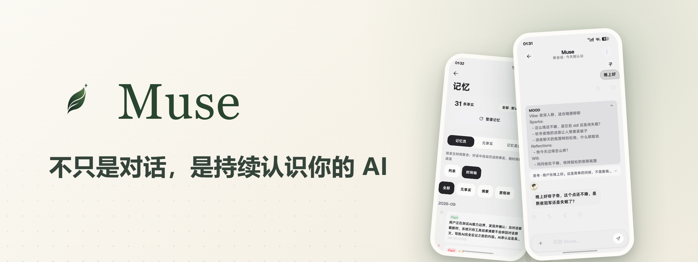

<p align="center">
  
</p>

<p align="center">
  <a href="README_EN.md">English</a> · <b>中文</b>
</p>

<p align="center">
  <a href="https://github.com/Zer0Qing/Muse/releases/latest"></a>
  <a href="https://github.com/Zer0Qing/Muse/releases"></a>
  <a href="https://github.com/Zer0Qing/Muse/stargazers"></a>
  <a href="LICENSE"></a>
  
  
</p>
<p align="center">
  <a href="https://qm.qq.com/q/905451314"></a>
  <a href="https://museai.ltd"></a>
  <a href="https://museai.ltd/download/"></a>
</p>

<p align="center">
  <a href="#muse-是什么">Muse 是什么</a> ·
  <a href="#截图">截图</a> ·
  <a href="#下载">下载</a> ·
  <a href="#快速上手">快速上手</a> ·
  <a href="#功能一览">功能一览</a> ·
  <a href="用户手册.md">用户手册</a> ·
  <a href="#开源共创">开源共创</a>
</p>

---

## Muse 是什么

每次打开新的 AI 对话，都要从头自我介绍一遍？Muse 不用。

Muse 是一个运行在 Android 上的开源 AI 伴侣：**通过四层记忆系统真正记住你**，通过无障碍 / Shizuku / Root 三层权限通道**在你手机里真正动手**，还有自己的内心（Mood）与生活——朋友圈、日记本、相册。换模型、切会话、关掉重开，它都记得；久未联系时，它会主动来找你。

模型随便换（40+ 预置供应商），不用注册、没有账号，**数据默认全部留在本地**；还可以接进微信、QQ、飞书、Telegram、钉钉，让助手长在你每天用的聊天工具里。

一切为了延续你们的对话，而不是从零开始。

## 截图

<p align="center">
  
  
  
  
</p>

<details>
<summary><b>更多截图</b>（点击展开）</summary>

<p align="center">
  
  
  
</p>
<p align="center">
  
  
  
</p>
<p align="center">
  
  
  
</p>

</details>

## 下载

| 你的设备 | 选择 | 说明 |
| --- | --- | --- |
| 近几年的手机 | `arm64-v8a` | 推荐，体积最小 |
| 较老的手机 | `armeabi-v7a` | 兼容老机型 |
| 不确定 | `universal` | 通用包，全兼容 |

最新 APK 从官网下载页 [museai.ltd/download](https://museai.ltd/download/) 下载（国内直连，推荐）；也可以前往 [GitHub Releases](https://github.com/Zer0Qing/Muse/releases/latest) 获取。覆盖安装即可，数据不丢。

> [!WARNING]
> 请仅从官方 Releases 页面或官网下载安装包。未知渠道的安装包可能被修改，造成数据和设备安全风险。

> [!NOTE]
> 应用内更新仅跳转 GitHub 官方 HTTPS 资产，不会自动下载或静默安装 APK。安装时提示"未知来源"属正常现象。

## 快速上手

1. **配置模型服务** —— 打开 **设置 → 模型服务**，选择预置供应商（DeepSeek、通义千问、智谱等注册均送免费额度），填入 API Key，测试连接后拉取模型列表。
2. **开始对话** —— 回到首页发第一条消息。记忆从这一刻开始积累；换模型、换会话，它都记得你。
3. **按需解锁系统能力（可选）** —— 想让它"动手"，打开 **设置 → 权限配置向导**，按引导开启无障碍 / Shizuku / Root / Termux 中你需要的通道；每一步都有检测与测试入口。

> 更完整的使用说明（包括各种手势和藏起来的操作）见 [用户手册](用户手册.md)，或应用内 **设置 → 使用教程**。

## 为什么是 Muse

### 一、持久记忆 —— 它不会每次都重新认识你

四层记忆架构，从短期对话到长期深度处理逐层递进：

```
对话 --> 事实提取 --> 滚动摘要 --> 编译聚合 --> 深度处理
 短期     关键信息     压缩归档     去重整合     深度理解
```

- **关键事实永不衰减**（医疗、财务、核心身份受保护），日常信息像人一样自然淡忘
- 每条记忆可追溯来源，记忆面板可增删、调权重、筛选搜索，长条目点击展开全文
- 记忆按空间隔离管理；备份换机全程加密

### 二、系统级行动力 —— 它会在你的手机里真正动手

| 通道 | 能力 | 门槛 |
|------|------|------|
| 无障碍服务（独立进程） | 读屏、点击 / 滑动 / 长按 / 输入、返回 / Home / 通知栏 | 开一个系统开关 |
| Shell（Shizuku / adb） | 截屏、input 命令、查前台应用、设备命令 | 授权一次 |
| Root | 完全系统控制、访问其他应用数据 | 需 root 设备 |
| Termux | 完整 Linux 环境（apt / pip / gcc / ffmpeg） | 安装 Termux 并授权 |

- 当前注册 **141 个工具**，默认分层暴露，长尾能力用 `find_tools` 按需检索装载
- 每个工具标注所需授权与就绪状态，未就绪时**执行前快速失败**并给出明确指引
- 内置终端（自研 PTY + xterm）、后台**虚拟屏**、视觉驱动的 **GUI Agent**、浏览器自动化
- 安全边界：命令白名单、风险审批（信任 / 询问 / 严格）、硬超时、工作区沙箱

### 三、人格与团队 —— 它有内心、也有生活

- **Mood 四维腹稿**：每次回复前的 Vibe / Sparks / Reflections / Will，默认折叠，展开可看它"怎么想的"
- **三层人设**：人设层 / 关系层 / 风格层，配套 `{{user_name}}` / `{{char}}` 模板变量
- **多 Agent**：`@助手名` 随时委派、任务卡可视化、子代理浮窗、助手间私信收件箱
- **群聊会议**：总结卡 / 表决 / 观察者 / 快速模板 / 会议控制（暂停 · 跳过），一场正经的多助手会议
- **相伴里程碑**：第 1 条消息、第 7 / 30 / 100 天、第 100 / 1000 条消息…都替你记着

## 功能一览

<details>
<summary><b>对话体验</b> —— 流式与续传 / 会话管理 / 消息操作 / 多模型 / 语音 / 多模态 / 搜索</summary>

- **流式与容错**：SSE 逐字输出、随时停止；断流自动续传（网络恢复后接着写）。内置 stream-guard 检测"流式过早结束"（空流 / 零首包）自动降级非流式重试；首事件看门狗（普通模型 45 秒 / 推理模型 90 秒无首包时自动切换请求方式），慢模型不再"卡死等不来消息"。
- **会话管理**：置顶 / 归档 / 删除可撤销 / 文件夹分组 / 置顶拖拽排序；全局搜索基于 SQLite FTS5 全文索引（兼容环境自动回退 FTS4）；每个会话独立上下文窗口，超长对话自动滚动摘要压缩。
- **消息操作**：重新生成保留多版本（`1/3` 切换、历史不丢）；分支（从任意用户消息开出新对话线，原线完整保留）；引用回复（原文注入上下文）；消息批注；长按菜单含复制（纯文本 / Markdown）、转发、分享、收藏、编辑、翻译、朗读、删除。
- **收藏夹**：收藏集中管理，长按可设分组标签。
- **输入体验**：全屏输入（长文专用）、斜杠命令（`/new` `/compact` `/reset` `/pin` `/archive`）、粘贴转文件（阈值可调）、快捷消息；上次被打断的工具调用可一键"恢复执行"或丢弃。
- **快速记录**：悬浮胶囊（可选开启），任意界面速记，落盘到本机速记库。
- **深度思考**：推理等级 OFF / AUTO / LOW / MEDIUM / HIGH / XHIGH（对应思考预算 1000 → 16000 tokens），推理过程折叠展示。
- **多模型**：原生支持 OpenAI / Anthropic / Gemini 三类协议与任意 OpenAI 兼容端点；40+ 预置供应商，模型列表动态拉取；模型能力矩阵（视觉 / 推理 / 工具）逐模型标注；辅助任务走独立"小工具 / 大工具"模型档位（标题、压缩、摘要、记忆编译分档路由）；支持自定义请求头 / 请求体与网络代理。
- **语音**：流式语音识别（边说边转字、波形可视化、上滑取消）；TTS 支持系统语音与云端语音（OpenAI / MiniMax / Edge 等）按助手独立配置；支持云端声音克隆（ElevenLabs / FishAudio）。
- **多模态输入**：图片多张发送；PDF / DOCX / EPUB / TXT 自动解析；扫描件走离线 OCR。
- **视觉辅助**：给不支持视觉的模型发图时，自动调用视觉模型生成八维结构化描述（整体概述 / OCR 文字 / 物体布局 / 图表数据 / 请求重述 / 请求回答 / 视觉证据 / 不确定性），支持坐标 grounding；描述按"图片 + 请求 + 提示词版本"缓存；多图并发分析、60 秒超时、失败自动降级为文字提示。
- **联网与浏览**：搜索源可配置（模型原生搜索 / Bing / 百度 / SearXNG / Tavily / 自定义端点）逐级兜底；网页正文提取走 Jina Reader；每个会话独立的内置浏览器，AI 上网时顶部胶囊可展开实时画面。
- **翻译与朗读**：长按消息即译 / 即读；翻译模型可单独配置；保留翻译历史。
- **渲染与卡片**：Markdown 全量渲染（代码高亮 20+ 语言、KaTeX 公式、Mermaid 图表、表格）；AI 可输出交互式卡片与产物卡片（代码 / 文档 / 表格），产物中心统一管理、可全屏查看与导出。

</details>

<details>
<summary><b>记忆与成长</b> —— 四层流水线 / 衰减与保护 / 上下文连续性 / 经验库 / 知识库 / 主动消息</summary>

- **四层记忆流水线**：① 对话原始流；② 事实提取（自动抽取关键事实，标注重要度与来源）；③ 滚动摘要（长对话压缩不丢线索）；④ 深度处理（后台编译聚合、去重合并，形成长期记忆）。事实入库带全文索引，可检索。
- **重要度与衰减**：关键事实（医疗、财务、核心身份）受保护不衰减；日常信息按使用频率自然淡忘，像人一样。
- **记忆面板**：按空间 / 分类浏览；增删条目、调整重要度、按时间 / 权重筛选；每条记忆可溯源到来源会话；长条目点击展开全文。
- **记忆空间**：不同用途的记忆互相隔离，互不污染。
- **上下文连续性**：上下文窗口外的历史不再被静默丢弃——生成确定性历史摘录（保留对话原文片段与工具条目）插在窗口前；工具回合压缩时保留"助手说明"；长任务不再"失忆"。
- **经验库**：把"这类问题以后都这么处理"沉淀为经验，未来任务自动参考（可开关）。
- **知识库（RAG）**：文档导入自动解析、分块建索引；检索走语义检索 + 关键词匹配的混合排序；@ 文档定向检索；超大文件流式索引；离线环境自动降级本地检索；引用可溯源到原文片段。
- **每日总结与问候**：按设定时点生成当日回顾（首页可见，可选推送）；早间问候由模型结合记忆中的近期事项生成，不是固定模板。
- **主动消息**：多维评分决定是否开口；自适应间隔（随对话热度 / 情绪 / 活跃度浮动）；免打扰时段；保底触发（太久没聊主动问候）；深夜自主行动（写日记、整理记忆，不打扰）；每日推送内容可配（每日总结 / 深夜日记 / 朋友圈动态）。
- **里程碑**：首条消息、相伴第 7 / 30 / 100 天、第 100 / 1000 条消息等节点自动记录，可在里程碑页回看。
- **统计与活动面板**：统计页含总对话 / 总消息 / 日均 / 连续天数与每日热力图；活动面板展示定时任务 / 心跳 / 记忆编译的执行历史。

</details>

<details>
<summary><b>工具与自动化</b> —— 141 工具 / 权限分层 / 审批与预算 / 四通道 / 终端 / 虚拟屏 / GUI Agent</summary>

- **工具系统**：当前注册 141 个工具，按能力分层（核心 / 常用 / 可选 / 高级）暴露；默认只发常用工具精简上下文，长尾能力用 `find_tools` 按关键词检索并装载（装载后会话内持续可用）；系统提示内嵌工具能力索引。
- **权限分层**：需要 Shizuku / Root、无障碍、Termux 的工具逐一声明依赖与就绪状态（READY / NOT READY）；未就绪时执行前快速失败，返回结构化 `permission_required` 错误与授权指引。
- **审批体系**：风险等级（安全 / 普通 / 高危）× 三档模式（信任 / 询问 / 严格）；支持"本会话允许"与按工具自定义策略；高风险动作先问后做。
- **执行引擎**：只读工具受控并行（上限 3）提速；阻塞型工具专用线程池 + 硬超时；单条输出超限自动落盘（上下文只留预览 + read_file 引用）；统一成败判定；连续失败自动早停并如实告知原因；工具轮次默认不限（可设置上限），另有重复调用指纹 / 无进展检测 / 总调用数等熔断保护。
- **四通道执行**：无障碍（独立进程 Provider，AIDL 通信，主应用更新不掉线）/ Shizuku（Binder 提权）/ Root（su）/ Termux（RUN_COMMAND）——按可用性自动选择执行档位。
- **设备命令**：`device_shell` 走动词白名单（dumpsys / settings / am / pm / input / screencap / uiautomator / cmd / svc / wm / getprop / content 等），禁止管道 / 重定向 / 拼接，白名单之外一律拒绝。
- **内置终端**：自研 PTY 引擎 + xterm 终端页；三档环境——应用沙盒终端、设备命令通道、Termux 完整 Linux（apt / pip / gcc / ffmpeg）。
- **虚拟屏**：独立服务端进程在后台创建隐藏显示屏，Agent 的完整操作流不占用主屏，按需截帧回传。
- **GUI Agent**：视觉驱动的多步操作环——截图 → 视觉模型决策 → 点击 / 滑动 / 输入 → 再截图验证，直到任务完成。
- **浏览器自动化**：navigate / click / type / extract / scroll / get_html / snapshot；每个会话独立浏览器实例。
- **工作区**：受控文件空间（读 / 写 / 列目录 / 移动 / 删除），文件操作限制在沙箱边界内。
- **定时与提醒**：定时任务支持 Cron 表达式与执行历史；闹钟 / 倒计时 / 日程 / 备忘录；到点自动执行或提醒。
- **通知监听**：读取设备通知流，按内容智能回复或建议。
- **权限配置向导**：无障碍 / Shizuku / Root / Termux 四通道一键检测与引导，附"测试屏幕读取"实时验证。

</details>

<details>
<summary><b>多助手与生态</b> —— 群聊会议 / 世界书 / Skill / 插件市场 / MCP / 五端渠道</summary>

- **多助手**：每个助手独立配置模型 / 系统提示词 / 采样参数 / 资源绑定 / 工具白名单 / 技能；`@助手名` 委派任务，任务卡逐步骤显示执行状态；子代理在独立浮窗运行长任务，不占用主对话；助手间私信有独立收件箱。
- **助手进阶**：世界书（常驻条目 + 关键词触发 + 深度注入）；提示词注入（按模式注入自定义片段）；资源关联（绑定知识库优先检索）；导入导出——支持 SillyTavern 角色卡导入，自有助手可打包分享。
- **群聊会议**：四种讨论模式（轮转 / 自由 / 辩论 / 主持人）；每轮先读取群聊上下文；支持跳过本轮；每个助手独立记忆。会议能力：讨论总结专属卡片（复制 / 分享 / 存为共享文档）、表决票渲染、观察者成员、群共享文档与 AI 专属上下文、发言队列控制（暂停 / 继续 / 跳过）、快速模板（方案评审 / 正反辩论 / 头脑风暴 / 项目复盘）、轮次折叠、轮转中插话不丢。
- **Skill 系统**：内置技能开箱即用；`.skill.json` 导入导出（含参数 Schema）；提示词技能支持输入参数（`{{input}}` / `{{args}}` 占位符）；安装走白名单实现与注入防护。
- **插件市场**：检索 / 安装 / 启停 / 卸载与信任管理；插件可携带工具、UI 面板、消息气泡皮肤等扩展；助手可自写 JS 插件草稿，需经签名并手动启用后生效；插件运行在沙箱边界内。
- **MCP 协议**：连接外部 MCP Server 扩展工具（OAuth 鉴权 / SSE 传输 / 自动发现）。
- **OAuth 连接器**：接入第三方服务，凭据本地加密存储；连接中心统一管理模型 / 渠道 / 连接器。
- **渠道五端**：微信（扫码绑定）/ QQ（Bot WebSocket 长连接）/ 飞书（长连接事件通道）/ Telegram / 钉钉（Stream 模式）；每个联系人独立会话上下文与滚动摘要；图片 / 语音等媒体消息自动入库与转写；可按渠道绑定不同助手与模型；各平台带专属配置向导与连接测试。
- **Web 服务器**：内置 Ktor 服务（JWT 鉴权 + mDNS 发现 + HTTPS 自签证书），局域网内浏览器即可访问对话。

</details>

<details>
<summary><b>小手机与朋友圈</b>（早期实验版本，持续打磨中）—— 仿真 IM / AI 朋友圈 / 相册 / 日记本</summary>

- **小手机**：内置仿真即时通讯客户端——会话 / 通讯录 / 发现 / 我 四页结构，可换壁纸、可调设置，像用 IM 一样用 AI。
- **AI 朋友圈**：AI 会发布动态（图文 / 九宫格）、对动态点赞与评论；消息中心、封面、个人主页。
- **AI 相册 / 日记本**：生成的图片留档（带日期、全屏预览）；日记按月历查看，深夜 AI 会自己写日记。
- **天气页与速记**：免费天气数据源；随手速记收纳在"我"页。

</details>

<details>
<summary><b>界面与外观</b> —— 主题 / 气泡皮肤 / 图标 / 多语言 / 备份与数据</summary>

- **主题系统**：12 套完整主题（每套含亮 / 暗双模式）+ 8 套色盲友好配色；支持动态取色（Android 12+）、白天 / 夜间定时切换、自定义主题。
- **气泡与外观**：消息气泡圆角可调；气泡皮肤体系，含插件提供的扩展皮肤（如高对比 / 柔光）。
- **自绘图标**：176 枚全自绘图标（24dp 栅格 / 1.7dp 圆头笔触 / 深浅自适应），开源在 [muse-icons](https://github.com/Zer0Qing/muse-icons)（MIT）。
- **排版与多语言**：字体 / 字号 / 字间距、预测性返回、无障碍适配；界面支持中文 / English / 日本語 / 한국어 / Español / Português / Русский 七种语言。
- **备份与恢复**：本地一键导出（JSON / 分块 NDJSON，可加密）；每日自动备份（打包 muse.db / memory.db / facts.db 快照）；S3 / WebDAV 云同步；恢复前自动留保护副本，失败自动回滚。
- **数据导入**：CherryStudio / Chatbox 一键迁移；多格式对话记录导入。
- **表情包库**：zip 按文件夹结构导入自动分类；发送频率三档（偶尔 / 正常 / 频繁）；支持批量删除与清空。
- **桌面小部件**：一键新建对话；长按应用图标快捷菜单。
- **账户中心**：头像昵称本地管理，无登录注册——没有账号可以"丢"。
- **审计日志与代理**：工具调用与关键操作留痕；支持自定义网络代理。

</details>

<details>
<summary><b>安全与隐私</b> —— 本地优先 / 加密 / PII 打码 / 沙箱边界</summary>

- **数据本地化**：对话 / 记忆 / 知识库全部存储于本地 Room 数据库；无遥测、无分析、无数据收集；不注册、不登录；联网功能默认关闭。
- **PII 自动打码**：手机号 / 身份证 / 银行卡等在发送前自动遮蔽为占位符，模型回复中的占位符再还原——真实信息不发给服务商。
- **加密链路**：敏感配置走 Android Keystore（AES-256-GCM）；云备份密码 PBKDF2 + AES-256-GCM。
- **链接防护**：点击链接二次确认；WebView 渲染输出前净化（去 iframe / form / 伪协议）。
- **工具边界**：命令白名单、风险审批、硬超时、权限预检、失败原因如实回传；插件默认沙箱运行。
- **崩溃日志**：仅本地存储，安全模式下手动导出。

</details>

## 技术栈与架构

| 类别 | 技术 |
|------|------|
| 语言 / UI | Kotlin 2.4 · Jetpack Compose · Material 3 |
| 架构 | MVVM + 单向数据流 · Koin（DI） |
| 数据 | Room (SQLite) + DataStore · ONNX Runtime（本地 embedding） |
| 网络 | OkHttp + Ktor（Web 服务器 JWT + mDNS + HTTPS） |
| 解析与渲染 | PDFBox · ML Kit OCR · 自研 PTY + xterm |
| 质量门禁 | detekt + ktlint + Android Lint + 自定义检查脚本 · Kover 覆盖率 |

```
:app                        应用主体（UI / 会话 / 工具编排 / 渠道 / 设置）
:ai                         Provider 抽象层（OpenAI / Anthropic / Gemini，流式与工具调用）
:memory                     记忆引擎（事实库 / 编译聚合 / 摘要）
:accessibility(+provider)   无障碍服务与独立进程 Provider（主应用更新不掉线）
:terminal                   Termux 通道与终端
:virtual-display-*          虚拟屏服务端与协议
:common                     日志 / 结果类型等共享设施
```

## 从源码构建

前置：JDK 21、Android SDK（platform 35、build-tools 36.0.0）。

```bash
git clone https://github.com/Zer0Qing/Muse.git
cd Muse

# 调试构建
./gradlew :app:assembleDebug

# 安装到已连接设备
./gradlew :app:installDebug
```

正式发布构建需显式注入版本号并提供签名（缺任一项会被构建硬约束拦下）：

```powershell
./gradlew :app:assembleRelease "-PversionName=<x.y.z>" "-PversionCode=<号>"
# 签名：项目根目录需提供 keystore.properties（storeFile / storePassword / keyAlias / keyPassword）

# 发布前校验（全部 ABI 包签名一致性）
python ci/script/validate_release_apks.py --apk "app/build/outputs/apk/release/*.apk"
```

## 开源共创

欢迎参与项目建设：

- [贡献指南](CONTRIBUTING.md) · [安全政策](SECURITY.md) · [UI 组件库维护规范](UI组件库维护规范.md)
- 提交 PR 前请通过本地门禁脚本与单测；新增字符串需同步全部语言包
- 门禁与发布流水线脚本在 `ci/script/` 下；应用内置教程（设置 → 使用教程）同步维护

## 支持开发

Muse 由独立开发者维护，免费开源、无内购、无账号体系。如果它对你有帮助，欢迎自愿支持项目持续开发：

**请作者喝咖啡**（微信 / 支付宝扫码）：

<p align="center">
  
  
</p>

**加入交流群**（欢迎来聊）：

<p align="center">
  
  
</p>

> 赞助完全自愿，不与任何功能、额度或更新挂钩；不赞助不影响正常使用。

## 许可证

项目采用 **GNU General Public License v3**（GPL v3）。完整许可证文本见 [LICENSE](LICENSE)，第三方依赖许可证列表见 [NOTICE](NOTICE)。
