<p align="center">
  <picture>
    <source media="(prefers-color-scheme: dark)" srcset="app/src/main/res/drawable/ic_muse_logo.png">
    
  </picture>
</p>

<h1 align="center">Muse</h1>

<p align="center">
  <b>Not just chat — an AI that truly knows you</b><br>
  <i>Four-tier memory · Free model switching · System-level UI automation · Privacy-first · Open source</i>
</p>

<p align="center">
  <a href="README.md">中文</a> - <b>English</b>
</p>

<p align="center">
  <a href="https://github.com/Zer0Qing/Muse/stargazers"></a>
</p>
<p align="center">
  <a href="LICENSE"></a>
  
  
  
  <a href="https://github.com/Zer0Qing/Muse/actions/workflows/ci.yml"></a>
  <a href="https://github.com/Zer0Qing/Muse/releases/latest"></a>
  <a href="https://qm.qq.com/q/905451314"></a>
</p>
<p align="center">
  <a href="https://github.com/Zer0Qing/Muse/releases/latest"></a>
</p>

<p align="center">
  <a href="#what-is-muse">What is Muse</a> -
  <a href="#screenshots">Screenshots</a> -
  <a href="#features">Features</a> -
  <a href="软件功能.md">Feature Guide</a> -
  <a href="#quick-start">Quick Start</a> -
  <a href="#docs--contributing">Docs and Contributing</a> -
  <a href="#license">License</a>
</p>

---

## What is Muse

Most AI apps make you reintroduce yourself every time. Muse remembers.

Muse is an Android AI companion with a four-tier memory system that actually keeps track of who you are. Switch models, switch conversations, close the app and come back. It all stays.

Every response starts with an inner monologue (Mood). Four dimensions of what the AI is thinking, feeling, and reflecting. Folded by default, one tap to see.

**Your choice, your way:**
- Pick any model: OpenAI, Anthropic, Gemini, DeepSeek, you name it
- No signup, no accounts, data stays local
- Voice, search, tools, multi-agent group chat
- Even checks in when you have been away too long

All built around one idea: make conversations continue, not restart from zero.

Muse is a local-first AI companion app built for Android. It builds a persistent relationship with you through a 4-tier progressive memory system that remembers your preferences, your history, and what matters to you. It lets you choose the underlying model freely (OpenAI, Anthropic, Gemini, DeepSeek, or any OpenAI-compatible endpoint). It speaks, searches the web, executes tools, and even proactively starts a conversation when it has not heard from you in a while.

Muse has a unique capability: before each reply, it writes an "inner monologue" (Mood) with four dimensions -- Vibe, Sparks, Reflections, and Will. These thoughts are not shown in the main reply (collapsed by default), but you can expand them to glimpse the AI's genuine thinking process: its current feeling, passing associations, self-doubts, and what it wants to do next.

Everything works offline by default. No account required. No data leaves your device unless you explicitly enable it.

---

## Screenshots

<p align="center">
  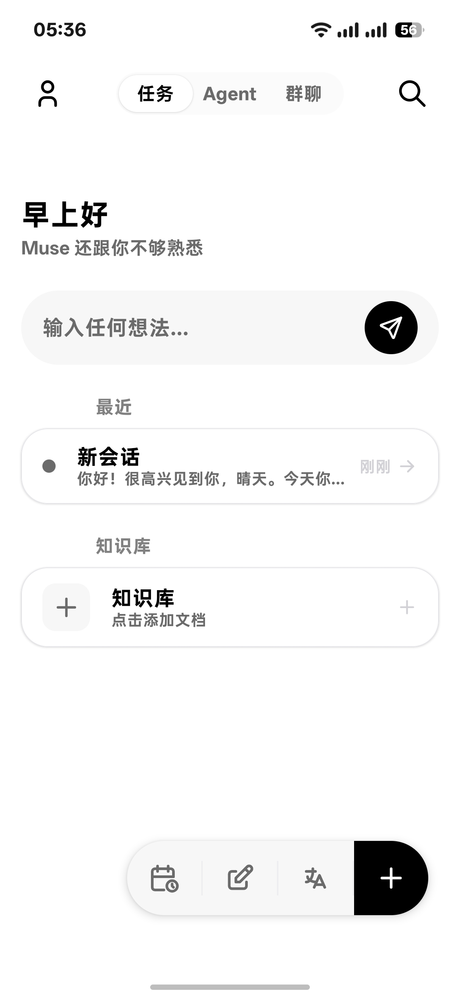
  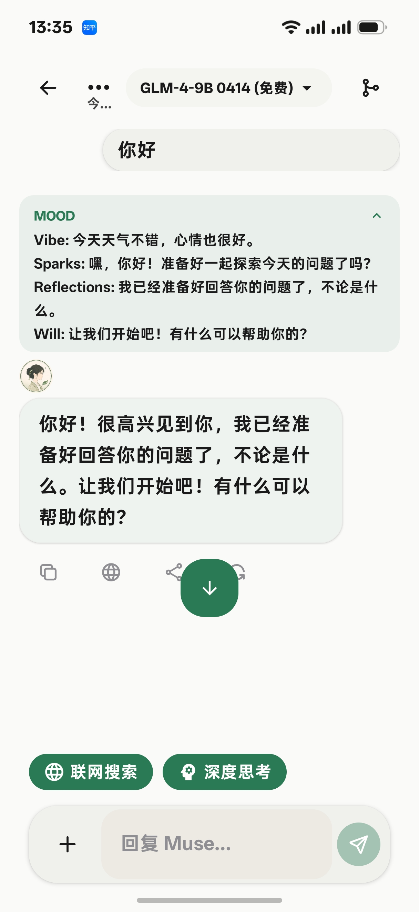
  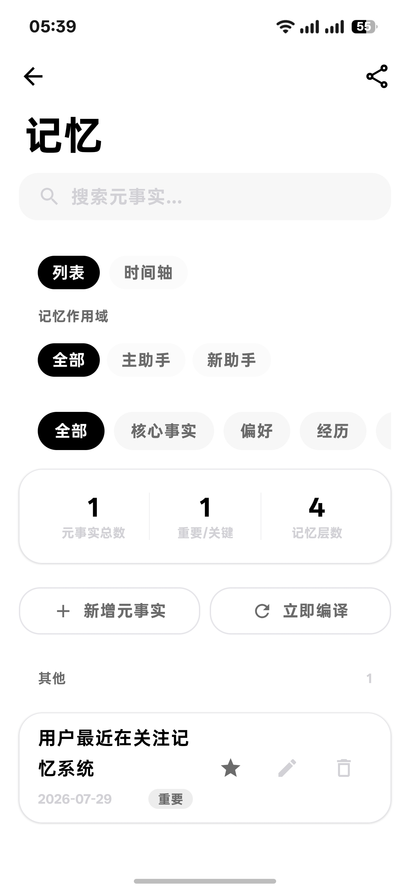
  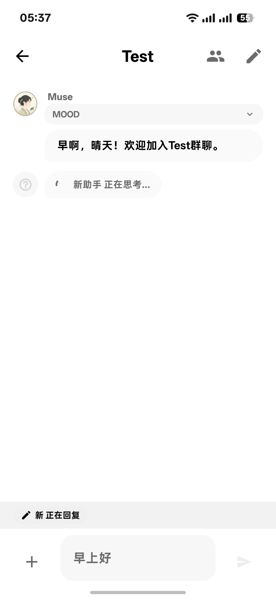
  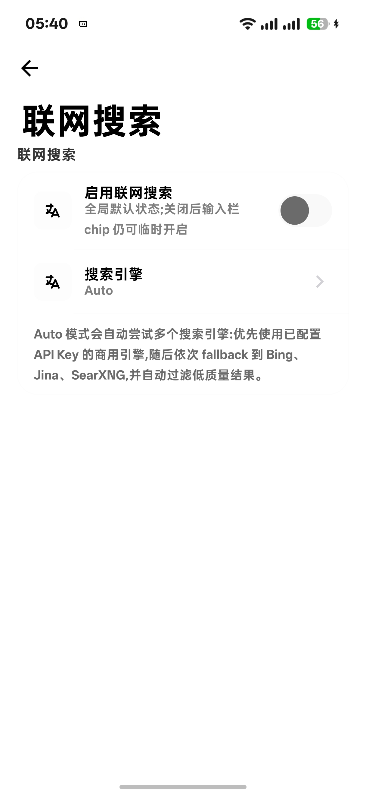
  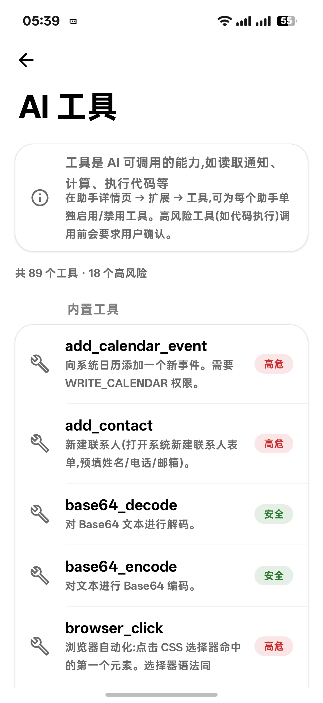
</p>
<p align="center">
  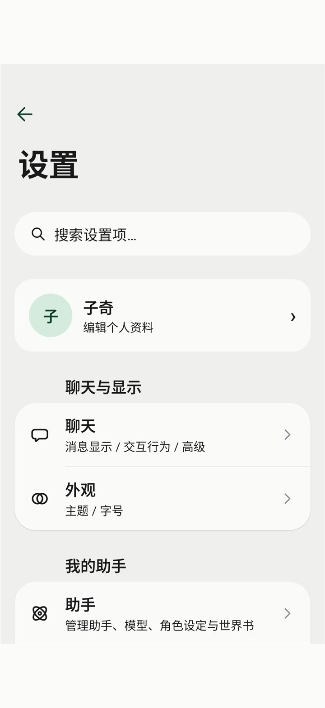
  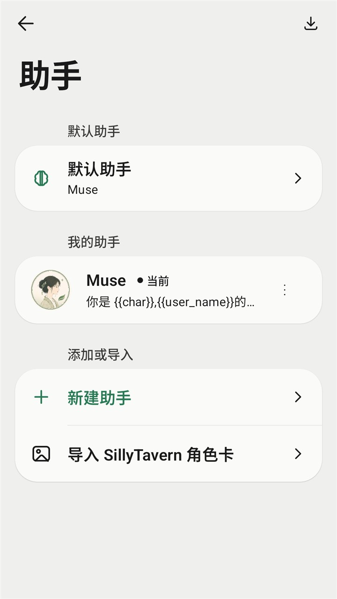
  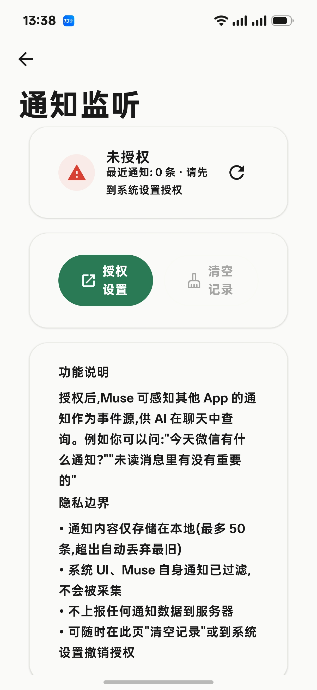
  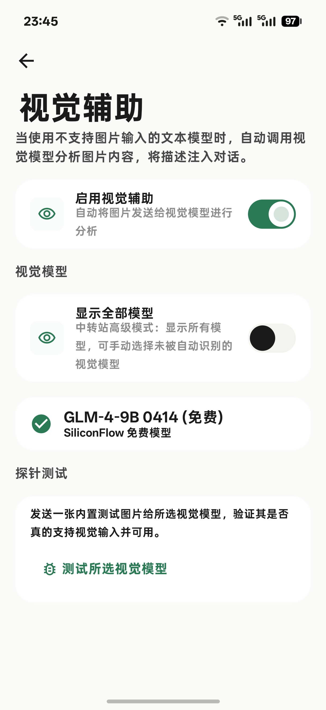
  
  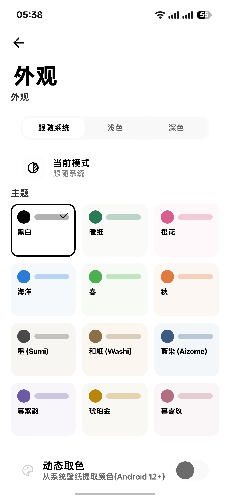
</p>

---

## Features

### Memory System

Muse has a 4-tier memory architecture, progressing from short-term conversation to long-term deep processing. Each tier has a clear responsibility:

```
Conversation --> Fact Extraction --> Rolling Summary --> Compile and Aggregate --> Deep Processing
  Short-term      Key info            Compression         Dedup and merge         Deep understanding
```

- **Tier 1 Conversation**: the raw message stream, retains full context for the current session
- **Tier 2 Fact Extraction**: pulls key facts (names, preferences, agreements) from conversations, tagged with importance and source
- **Tier 3 Rolling Summary**: compresses long conversations into rolling summaries to prevent unbounded context growth
- **Tier 4 Deep Processing**: aggregates and deduplicates into long-term memory, organized by topic and time, retrievable across all future sessions

- **Critical facts never decay**: medical info, financial data, core identity -- facts with importance >= 2 are protected and never fade over time
- **Routine info expires naturally**: ordinary preferences and chit-chat decay automatically as usage frequency drops
- **Traceable origin**: every memory is tagged with source session and ingestion time
- **Fully controllable**: adjust importance, delete, and filter memories manually in the memory panel

### System-level UI Automation

Muse can look at your screen and act inside other apps for you, through a three-tier permission ladder:

| Tier | Capability | Barrier |
|------|------------|---------|
| Accessibility | Read the screen's widget tree, simulate tap/swipe/long-press, type text, Back/Home/open notifications | Toggle one system setting |
| Shell (Shizuku/adb) | Screenshot, `input` commands, check the foreground app, silent install | Authorize once |
| Root | Full system control, access other apps' data, silent permission grants | Requires a rooted device |

- 10 new AI tools: read screen, check foreground app, tap by coordinates/text, swipe, type, launch app, Back, Home, open notifications, query permission status
- Automatic fallback: when the widget tree is unavailable it falls back to screenshot + Shell, and tells you exactly which tier is missing when it can't capture
- Settings → Tools & Connections → UI Automation shows all three tiers at a glance, with a "Test screen reading" button

### Multi-Provider Models

40+ built-in providers across three categories:

| Category | Providers |
|----------|-----------|
| International | OpenAI, Anthropic, Gemini, xAI Grok, Groq, Together, Mistral, OpenRouter, DeepInfra, Fireworks, Perplexity, GitHub Copilot |
| Chinese providers | DeepSeek, Qwen, GLM (Zhipu), Moonshot, Doubao, Baichuan, Lingyi, StepFun, MiniMax, Xiaomi MiMo |
| Local and others | Ollama (local), OpenCode, API2D, AIHubMix, DeepBricks, Agnes AI, custom templates |

Model IDs are fetched dynamically from each provider's `/models` endpoint -- no hardcoded lists, no app updates needed when new models launch.

### Vision Assist -- Let Text-Only Models See Images

When you send an image to a model that does not support multimodal input, Muse does not discard the image or error out. Instead, it automatically kicks off vision assist:

1. Uses your configured vision model (e.g. GPT-4o, Gemini) to analyze the image and produce a structured text description
2. The description covers eight dimensions: overall summary, visible text (OCR), objects and layout, charts and data, user-request restatement, request answer, visual evidence, and uncertainty
3. If the vision model supports grounding, it also returns coordinate-tagged key-element boxes (visual primitives)
4. Injects the description into your message wrapped in a `<vision-context>` tag, and clears the original image -- preventing a failed request from sending an image to a text-only model
5. The text-only model reads "what the image says," not pixels

Engineering details:

- Concurrent multi-image analysis with real-time progress (e.g. "analyzing 2/4")
- 60-second per-image timeout plus automatic 3-retry on network errors
- Image pre-compression (2000x2000, JPEG 80%) -- oversized images are no longer dropped
- Automatic fallback to streaming when a provider does not support non-streaming requests
- Descriptions are cached by "image plus request plus prompt version" -- resending the same image returns instantly
- On analysis failure, a fallback hint is injected and the image is cleared -- the original image is never sent to a text-only model

This means even if your primary model is a text-only reasoning model, it can still understand the screenshots, tables, and photos you send.

### Mood System -- The Four Dimensions of Thought

Before each reply, Muse generates a `mood` block -- its "inner monologue." These thoughts are not the final reply but the raw thinking that produces it. In the interface, mood is collapsed into a card by default. Expanding it reveals four dimensions:

- **Vibe**: The AI's immediate feeling and emotional state. Light, sharp, contemplative? A single sentence capturing the current mood.
- **Sparks**: Spontaneous associations and imagery that surface naturally. These sparks diverge in direction -- a metaphor, a memory, a new angle, an unexpected connection. Each spark charts a different path.
- **Reflections**: Self-doubts, uncertainties, and insights worth questioning. Not final answers, but the hesitation and curiosity during the thinking process.
- **Will**: The intent and desire crystallized after feeling (Vibe), diverging (Sparks), and reflecting (Reflections). Where the AI wants to go, what it wants to do.

These four dimensions progress from intuition to action: feel first (Vibe), then diverge (Sparks), then reflect (Reflections), finally crystallize into intent (Will). Every reply becomes more than text generation -- it is a complete thought process made visible.

<p align="center">
  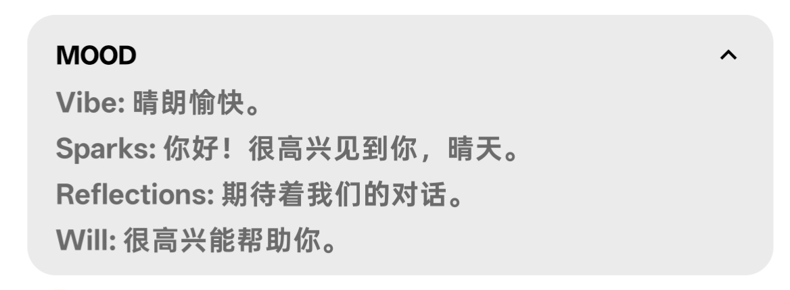
</p>

### Three-Layer Persona Architecture

Every assistant's persona is composed of three independently configurable layers:

- **Identity layer**: who you are -- role positioning, capability boundaries
- **Relationship layer**: the relationship with the user -- form of address, closeness, interaction style
- **Style layer**: how you speak -- tone, rhythm, vocabulary preferences

The three layers combine to make personas both clear to adjust and consistent. Supports `{{user_name}}` / `{{char}}` template variables for dynamic substitution in prompts.

### Multi-Agent Collaboration

Create multiple assistants with different personalities and specialties, delegating tasks anytime during a conversation:

- Type `@assistant-name` in the input bar to delegate
- Task cards visualize the execution status of each delegation step
- Team mode supports multi-assistant round-robin collaboration

### Group Chat

Pull multiple assistants into one session for collaborative discussions:

- Supports sequential and free-rotation reply modes
- AI reads the full group context before each round to track discussion progress
- Assistants can pass (channel_pass) to let others speak first
- Each assistant maintains an independent fact store in group chat, isolated from the main memory
- Real-time activity status: who is thinking, who has finished, who is waiting
- Ideal for multi-role discussions, collective brainstorming, and roundtable simulations

### Skill System and MCP Protocol

- 20+ built-in tools: file I/O, web search, knowledge base, calendar, clipboard, calculator, SMS, alarms, stickers, and more
- `.skill.json` import: create and share custom Skills with parameter schemas
- MCP Protocol: connect external MCP Servers to dynamically extend tool capabilities (OAuth auth, SSE transport, auto-discovery)

### Interaction and Media

- **Streaming voice recognition**: DashScope Paraformer / Step Whisper API; real-time transcription, long-press to record, swipe up to cancel, live waveform
- **Multimodal input**: ML Kit offline Chinese OCR; PDF parsing; auto-detects TXT/DOCX/EPUB; built-in DALL-E / Gemini image generation
- **Web search**: Jina AI Reader (Markdown summaries), Bing (Jsoup structured extraction), SearXNG/Tavily/custom endpoints
- **Proactive messaging**: AI proactively starts conversations when you have been out of touch; adjustable interval, time-window control, Agent-session only
- **Text-to-speech**: system TTS / cloud TTS (OpenAI/MiniMax/Edge); per-assistant rate/pitch/language; routing to speaker/earpiece/Bluetooth
- **Translation**: built-in translator with multi-language support and history retention
- **Notification listener**: listen to device notifications, AI can provide smart replies and suggestions based on notification content
- **Slash commands**: type `/` in the input bar for quick actions -- `/new` new chat, `/compact` compress context, `/reset` reset, `/pin` pin, `/archive` archive

### Theme System

12 complete themes, each with light and dark variants:

| Theme | Light | Dark |
|:------|:-----:|:----:|
| Warm Paper (default) | Yes | Yes |
| Sakura | Yes | Yes |
| Ocean | Yes | Yes |
| Spring | Yes | Yes |
| Autumn | Yes | Yes |
| AMOLED | Yes | Yes |
| Sumi (Ink) | Yes | Yes |
| Washi (Paper) | Yes | Yes |
| Aizome (Indigo) | Yes | Yes |
| Twilight Purple | Yes | Yes |
| Amber Gold | Yes | Yes |
| Dusk Rose | Yes | Yes |

Plus 8 colorblind-friendly palettes for custom themes. Every theme fully defines all Material 3 color roles.

### Platform Capabilities

- Home screen widgets: Glance Compose -- one-tap new conversation
- Embedded web server: Ktor + JWT + mDNS -- local network API access
- Config import: one-tap migration from CherryStudio / Chatbox
- Backup and restore: local file + S3 / WebDAV cloud sync
- Full-text search: Room FTS5 -- instant conversation history retrieval
- Sticker library: import zip archives, auto-categorize, probability-based auto-send
- Markdown rich text rendering: code highlighting (20+ languages), KaTeX math formulas, Mermaid diagrams

### Security and Privacy

- App PIN lock (exponential backoff: 5 failures -> 30s lockout); Deep Links blocked during lockout
- Sensitive config encrypted via Android Keystore (AES-256-GCM)
- Cloud backup encrypted with user-defined password (PBKDF2 + AES-256-GCM)
- URL highlight with confirmation: tapping a link shows a confirmation dialog before opening; long-press opens directly -- prevents misclicks and phishing
- WebView sanitizes LLM output -- strips iframe, form, javascript: pseudo-protocols
- All conversations/memories/knowledge base stored in local Room database -- no telemetry, no analytics, no data collection
- Network features off by default, opt-in only
- Crash logs stored locally only -- exportable via email in safe mode

---

## Tech Stack

| Category | Technology |
|----------|------------|
| Language | Kotlin 2.4 |
| UI | Jetpack Compose + Material 3 |
| Architecture | MVVM + unidirectional data flow |
| DI | Koin |
| Database | Room (SQLite) + DataStore |
| Network | OkHttp + Ktor |
| Serialization | kotlinx.serialization |
| Images | Coil (SVG/GIF) |
| AI Inference | ONNX Runtime (local embedding + rerank) |
| Document parsing | PDFBox + ML Kit OCR |
| Web server | Ktor (JWT + mDNS) |
| Code analysis | detekt + ktlint |

---

## Quick Start

> Want to try it first? Just [download the latest APK](https://github.com/Zer0Qing/Muse/releases/latest) and install -- no need to build yourself.

### Prerequisites

- Android 8.0 (API 26) or later device
- An API key for any AI provider (OpenAI / Gemini / DeepSeek, etc.)

### Build and Install (for developers)

```bash
git clone https://github.com/Zer0Qing/Muse.git
cd Muse

# Debug build
./gradlew :app:assembleDebug

# Install to a connected device
./gradlew :app:installDebug

# Release build (requires version injection + signing config)
# Version is hard-required (GradleException otherwise): pass
#   -PversionName=<name> and -PversionCode=<int>, or env VERSION_NAME/VERSION_CODE.
# Signing: a keystore.properties next to the app/ module is mandatory (no debug-sign fallback).
./gradlew :app:assembleRelease \
  -PversionName=1.0.80 \
  -PversionCode=180
```

APK output: `app/build/outputs/apk/release/app-{abi}-release.apk`

### First Run

Onboarding walks you through initial setup in six steps:

1. **Welcome** -- discover Muse's core capabilities
2. **Language and Appearance** -- choose interface language and theme
3. **Your Name** -- set your name and your assistant's name
4. **Configure Provider** -- pick a built-in provider and enter your API key (supports connection test)
5. **Select Model** -- choose a default model from the fetched model list
6. **Done** -- start chatting -- from now on, Muse remembers everything

---

## Docs and Contributing

### User Documentation

The app ships with a full in-app tutorial (Settings -> Tutorial). A standalone feature guide is also available:

- [Feature Guide](软件功能.md) -- a complete manual organized around "what can you do with it"

### Developer Documentation


### Contributing

Contributions are welcome:

- [Contributing Guide](CONTRIBUTING.md) -- bug reports, feature suggestions, pull request workflow
- [Security Policy](SECURITY.md) -- vulnerability reporting and built-in security mechanisms

---

## License

Muse is licensed under the **GNU General Public License v3** (GPL v3). Full license text in [LICENSE](LICENSE). Third-party dependency licenses in [NOTICE](NOTICE).