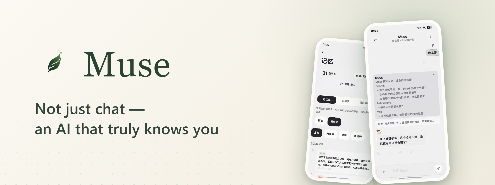
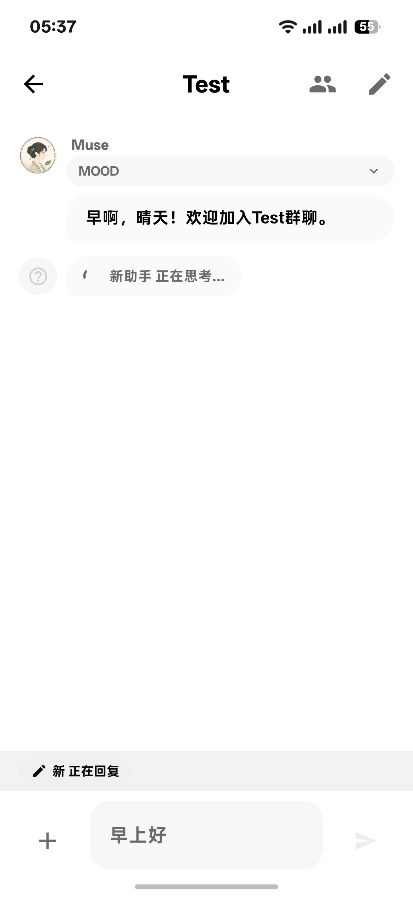
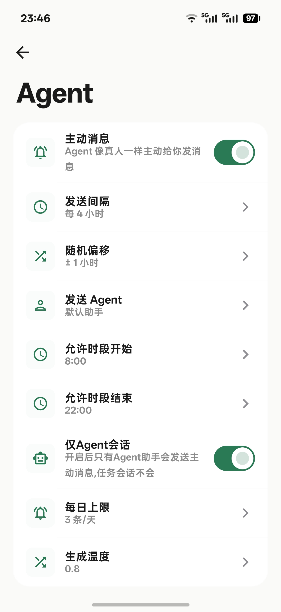
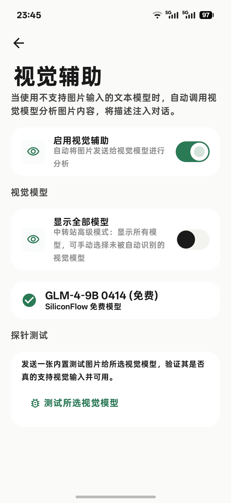
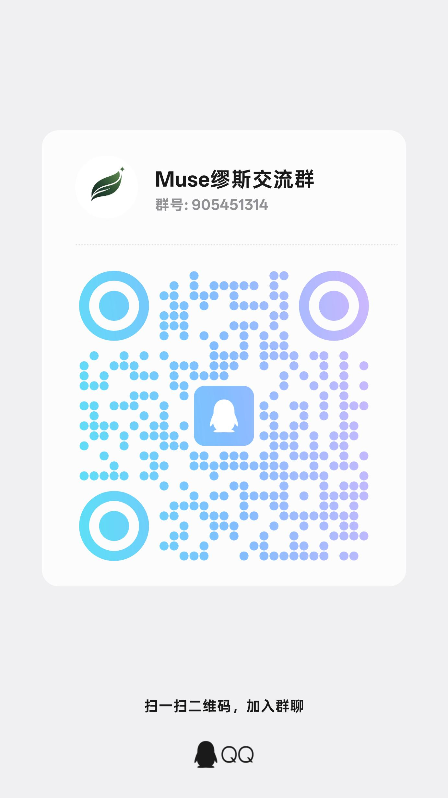

<p align="center">
  
</p>

<p align="center">
  <b>English</b> · <a href="README.md">中文</a>
</p>

<p align="center">
  <a href="https://github.com/Zer0Qing/Muse/releases/latest"></a>
  <a href="https://github.com/Zer0Qing/Muse/releases"></a>
  <a href="https://github.com/Zer0Qing/Muse/stargazers"></a>
  <a href="LICENSE"></a>
  
  
</p>
<p align="center">
  <a href="https://qm.qq.com/q/905451314"></a>
  <a href="https://museai.ltd"></a>
  <a href="https://museai.ltd/download/"></a>
</p>

<p align="center">
  <a href="#what-is-muse">What is Muse</a> ·
  <a href="#screenshots">Screenshots</a> ·
  <a href="#download">Download</a> ·
  <a href="#quick-start">Quick Start</a> ·
  <a href="#features">Features</a> ·
  <a href="#open-source">Open Source</a>
</p>

---

## What is Muse

Tired of introducing yourself from scratch to every new AI chat? Not with Muse.

Muse is an open-source AI companion for Android: it **truly remembers you** through a four-tier memory system, it **gets things done on your phone** through Accessibility / Shizuku / Root permission tiers, and it has an inner life (Mood) and a life of its own — Moments, a diary, an album. Switch models, switch sessions, close and reopen the app: it still remembers. When it's been a while, it will reach out to you first.

Bring any model (40+ preset providers). No sign-up, no account, and **your data stays on your device by default**. Muse also plugs into WeChat, QQ, Feishu, Telegram and DingTalk, so your assistant lives inside the chat apps you already use every day.

Everything is built to continue your conversation — not to start over.

## Screenshots

<p align="center">
  
  
  
  
</p>

<details>
<summary><b>More screenshots</b> (click to expand)</summary>

<p align="center">
  
  
  
</p>
<p align="center">
  
  
  
</p>
<p align="center">
  
  
  
</p>

</details>

## Download

| Your device | Choose | Notes |
| --- | --- | --- |
| Recent phones | `arm64-v8a` | Recommended, smallest download |
| Older phones | `armeabi-v7a` | For older devices |
| Not sure | `universal` | Works everywhere |

Download the latest APK from the official download page [museai.ltd/download](https://museai.ltd/download/) (fast direct downloads in China); it's also available on [GitHub Releases](https://github.com/Zer0Qing/Muse/releases/latest). Install over the top — your data stays intact.

> [!WARNING]
> Only download from the official Releases page or the official website. Packages from unknown sources may be tampered with, risking your data and device.

> [!NOTE]
> In-app updates only open the official GitHub HTTPS assets; the app never downloads or silently installs APKs. A "Unknown sources" prompt during installation is expected.

## Quick Start

1. **Configure a model provider** — open **Settings → Model Providers**, pick a preset provider (DeepSeek, Qwen, Zhipu and others offer free credits on sign-up), paste your API key, test the connection and fetch the model list.
2. **Start chatting** — go back to the home screen and send your first message. Memory starts accumulating from that moment; switch models or sessions and it still remembers you.
3. **Unlock system-level abilities (optional)** — to let it act on your phone, open **Settings → Permission Wizard** and enable the Accessibility / Shizuku / Root / Termux channels you need. Every step has built-in detection and test entry points.

> A complete usage guide (including all the gestures and hidden operations) is available in the [user manual (Chinese)](用户手册.md) and in-app under **Settings → Tutorial**.

## Why Muse

### 1. Persistent memory — it never reintroduces itself

A four-tier memory architecture, from short-term conversation to long-term deep processing:

```
chat --> fact extraction --> rolling summary --> compilation --> deep processing
short     key facts          compression        dedup/merge     long-term memory
```

- **Critical facts never decay** (medical, financial, core identity are protected), while everyday details fade naturally like a human would
- Every memory entry is traceable to its source; the memory panel supports editing, weight adjustment, filtering and search, with long entries expandable in place
- Memories are isolated by space; backups are encrypted end to end

### 2. System-level agency — it really does things on your phone

| Channel | Capabilities | Requirement |
|---------|--------------|-------------|
| Accessibility (separate process) | Read the screen tree, tap / swipe / long-press / type, Back / Home / notification shade | One system toggle |
| Shell (Shizuku / adb) | Screenshots, `input` commands, foreground app lookup, device commands | One-time authorization |
| Root | Full system control, access other apps' data | Rooted device |
| Termux | Full Linux environment (apt / pip / gcc / ffmpeg) | Install Termux and authorize |

- Currently **141 registered tools**, exposed in tiers by default; long-tail capabilities are loaded on demand via `find_tools`
- Every tool declares its required authorization and readiness (READY / NOT READY); unready calls **fail fast before execution** with clear guidance
- Built-in terminal (custom PTY + xterm), background **virtual display**, vision-driven **GUI Agent**, browser automation
- Safety boundaries: command allowlist, risk-based approval (Trusted / Ask / Strict), hard timeouts, workspace sandbox

### 3. Personality & team — it has an inner life, and a life

- **Mood, in four dimensions**: Vibe / Sparks / Reflections / Will before every reply, collapsed by default — expand to see what it was thinking
- **Three-layer persona**: persona / relationship / style layers, with `{{user_name}}` / `{{char}}` template variables
- **Multi-agent**: delegate with `@assistant-name`, task cards visualize each step, sub-agents run in floating windows, assistants have a private DM inbox
- **Group meetings**: summary cards / votes / observers / quick templates / meeting controls (pause, skip) — a proper multi-assistant meeting
- **Milestones**: first message, day 7 / 30 / 100, message 100 / 1000 — all remembered for you

## Features

<details>
<summary><b>Chat Experience</b> — streaming & continuity / sessions / message tools / multi-model / voice / multimodal / search</summary>

- **Streaming & resilience**: SSE token-by-token output, stop anytime; interrupted streams auto-resume when the network recovers. A built-in stream guard detects "premature stream end" (empty streams / zero first byte) and falls back to a non-streaming retry; a first-event watchdog (45s for regular models, 90s for reasoning models without a first token) switches request modes automatically, so slow models no longer leave you staring at a blank screen.
- **Session management**: pin / archive / undoable delete / folders / drag-to-reorder pinned sessions; global search backed by SQLite FTS5 (with automatic FTS4 fallback); each session has its own context window, and long conversations are compressed with rolling summaries.
- **Message tools**: regenerate with version history (`1/3` switcher, nothing lost); branching (fork a new timeline from any user message, the original stays intact); quote-reply (the quoted text is injected into context); message annotations; long-press menu with copy (plain text / Markdown), forward, share, favorite, edit, translate, read aloud, delete.
- **Favorites**: a dedicated favorites view, with group tags on long-press.
- **Input experience**: full-screen input for long texts, slash commands (`/new` `/compact` `/reset` `/pin` `/archive`), paste-as-file (configurable threshold), quick messages; an interrupted tool call can be resumed with one tap or discarded.
- **Quick capture**: an optional floating capsule for jotting down notes from any screen.
- **Deep thinking**: reasoning levels OFF / AUTO / LOW / MEDIUM / HIGH / XHIGH (roughly 1,000 → 16,000 thinking tokens), with the reasoning process shown collapsed.
- **Multi-model**: native OpenAI / Anthropic / Gemini protocols plus any OpenAI-compatible endpoint; 40+ preset providers with dynamically fetched model lists; per-model capability matrix (vision / reasoning / tools); auxiliary tasks routed through separate "small tool / large tool" model tiers (titles, compression, summaries, memory compilation); custom request headers, request bodies and network proxy.
- **Voice**: streaming speech-to-text (live transcription, waveform, swipe-up to cancel); TTS via system voices or cloud voices (OpenAI / MiniMax / Edge and more) configured per assistant; cloud voice cloning (ElevenLabs / FishAudio).
- **Multimodal input**: multiple images per message; automatic parsing of PDF / DOCX / EPUB / TXT; offline OCR for scans.
- **Vision assist**: when you send images to a non-vision model, a vision model generates an eight-dimension structured description (overview / OCR text / objects & layout / chart data / request restatement / answer / visual evidence / uncertainty) with coordinate grounding; descriptions are cached per "image + request + prompt version"; multi-image analysis runs concurrently with a 60-second timeout and a graceful text-only fallback.
- **Web search & browsing**: configurable search sources (native model search / Bing / Baidu / SearXNG / Tavily / custom endpoints) with layered fallback; article extraction via Jina Reader; a per-session built-in browser with a capsule that expands into a live view while the AI browses.
- **Translation & read-aloud**: translate or read any message on long-press; the translation model is configurable; translation history is kept.
- **Rendering & cards**: full Markdown rendering (syntax highlighting for 20+ languages, KaTeX formulas, Mermaid diagrams, tables); the AI can emit interactive cards and artifact cards (code / documents / tables) managed in an artifact center.

</details>

<details>
<summary><b>Memory & Growth</b> — four-tier pipeline / decay & protection / context continuity / experience library / knowledge base / proactive messages</summary>

- **Four-tier memory pipeline**: (1) the raw conversation stream; (2) fact extraction (key facts extracted automatically, tagged with importance and source); (3) rolling summaries (long conversations compressed without losing the thread); (4) deep processing (background compilation, deduplication and merging into long-term memory). Facts are full-text indexed and searchable.
- **Importance & decay**: critical facts (medical, financial, core identity) are protected from decay; everyday details fade with use, like a human would.
- **Memory panel**: browse by space / category; add, edit and delete entries; adjust importance; filter by time or weight; trace every memory back to its source session; long entries expand in place.
- **Memory spaces**: memories for different purposes are isolated from each other.
- **Context continuity**: history that scrolls out of the context window is no longer silently dropped — a deterministic digest (with verbatim conversation fragments and tool entries) is placed ahead of the window; tool-round compression preserves the assistant's own notes. Long tasks no longer cause "amnesia".
- **Experience library**: distil "handle this kind of problem this way" into reusable experiences that future tasks consult automatically (toggleable).
- **Knowledge base (RAG)**: imported documents are parsed, chunked and indexed; retrieval uses hybrid semantic + keyword ranking; @-mentions scope retrieval to specific documents; very large files are indexed in a streaming fashion; offline environments fall back to local retrieval; citations trace back to the original passages.
- **Daily summary & greetings**: a recap generated at configurable times (visible on the home screen, optionally pushed); morning greetings are generated from near-term items in memory, not templates.
- **Proactive messages**: a multi-factor score decides when to speak up; adaptive intervals (floating with conversation heat / mood / activity); quiet hours; a fallback trigger for long silences; night-time autonomous actions (writing its diary, tidying memories) that never disturb you; configurable daily pushes (summary / diary / Moments).
- **Milestones**: first message, days 7 / 30 / 100 together, messages 100 / 1000 and more are recorded automatically.
- **Stats & activity panel**: conversation / message totals, daily average, streaks and a daily heatmap; an activity panel shows the execution history of scheduled tasks, heartbeats and memory compilation.

</details>

<details>
<summary><b>Tools & Automation</b> — 141 tools / permission tiers / approvals & budgets / four channels / terminal / virtual display / GUI Agent</summary>

- **Tool system**: 141 registered tools, exposed in tiers (core / standard / optional / advanced); only common tools are sent by default to keep context lean, while long-tail capabilities load on demand via `find_tools` (loaded tools stay available for the session); a tool capability index is embedded in the system prompt.
- **Permission tiers**: every tool that needs Shizuku / Root, Accessibility or Termux declares its dependencies and readiness (READY / NOT READY); unready calls fail fast with a structured `permission_required` error and authorization guidance.
- **Approvals**: risk levels (safe / normal / high) combined with three modes (Trusted / Ask / Strict); "allow for this session" and per-tool policies; high-risk actions always ask first.
- **Execution engine**: read-only tools run with bounded parallelism (max 3); blocking tools run on a dedicated thread pool with hard timeouts; oversized outputs are written to disk with previews and `read_file` references in context; a unified success judge; automatic early stop on repeated failures with honest reasons; tool rounds are unlimited by default (a cap is configurable), with circuit breakers for repeated identical calls, no-progress rounds and total call counts.
- **Four execution channels**: Accessibility (separate-process provider over AIDL, surviving main-app updates) / Shizuku (Binder elevation) / Root (su) / Termux (RUN_COMMAND) — the tier is chosen automatically by availability.
- **Device commands**: `device_shell` runs through a verb allowlist (dumpsys / settings / am / pm / input / screencap / uiautomator / cmd / svc / wm / getprop / content, etc.); pipes, redirection and command chaining are rejected, as is anything outside the allowlist.
- **Built-in terminal**: custom PTY engine with an xterm terminal page; three environments — the app sandbox shell, the device command channel, and a full Termux Linux (apt / pip / gcc / ffmpeg).
- **Virtual display**: a separate server process creates a hidden display in the background so the agent's full workflow never takes over your main screen; frames are captured on demand.
- **GUI Agent**: a vision-driven multi-step loop — screenshot → vision-model decision → tap / swipe / type → screenshot verification, until the task is done.
- **Browser automation**: navigate / click / type / extract / scroll / get_html / snapshot, with an independent browser instance per session.
- **Workspace**: a controlled file space (read / write / list / move / delete) confined to sandbox boundaries.
- **Schedules & reminders**: scheduled tasks with cron expressions and run history; alarms, timers, calendar events and memos fire or notify on time.
- **Notification listener**: reads the device notification stream and replies or suggests intelligently.
- **Permission wizard**: one-stop detection and guidance for all four channels, with a live "test screen reading" check.

</details>

<details>
<summary><b>Assistants & Ecosystem</b> — group meetings / world book / skills / plugin market / MCP / five chat platforms</summary>

- **Multiple assistants**: each assistant configures its own model, system prompt, sampling parameters, bound resources, tool allowlist and skills; delegate with `@name`; task cards show each step's status; sub-agents run long tasks in floating windows without blocking the main conversation; assistants have a private DM inbox.
- **Assistant extras**: world book (always-on entries + keyword triggers + depth injection); prompt injections (custom snippets injected per mode); resource binding (attach a knowledge base for priority retrieval); import & export — including SillyTavern character card import, and packing your own assistants for sharing.
- **Group meetings**: four discussion modes (rotation / free / debate / host-led); the full group context is read before each round; a pass option for skipping a turn; per-assistant isolated memory. Meeting features: discussion summary cards (copy / share / save as a shared doc), vote rendering, observer members, group shared docs and per-AI private context, speaking-queue controls (pause / resume / skip), quick templates (design review / debate / brainstorm / retrospective), round folding, and no lost interjections during rotation.
- **Skill system**: built-in skills work out of the box; `.skill.json` import & export with parameter schemas; prompt skills accept inputs (`{{input}}` / `{{args}}` placeholders); installation goes through implementation allowlists and injection guards.
- **Plugin market**: search / install / enable / disable / uninstall with trust management; plugins can contribute tools, UI panels, message bubble skins and more; the assistant can draft JS plugins itself, which take effect only after signing and manual enabling; plugins run inside sandbox boundaries.
- **MCP**: connect external MCP servers to extend the tool set (OAuth, SSE transport, automatic discovery).
- **OAuth connectors**: connect third-party services with credentials encrypted locally; a connection center manages models, channels and connectors in one place.
- **Five chat platforms**: WeChat (QR binding), QQ (bot WebSocket), Feishu (long-connection events), Telegram, DingTalk (Stream mode); per-contact session context with rolling summaries; images and voice messages are ingested and transcribed; each channel can bind a different assistant and model; every platform ships with its own setup wizard and connection test.
- **Web server**: a built-in Ktor server (JWT auth + mDNS discovery + self-signed HTTPS) lets you browse conversations from any device on your LAN.

</details>

<details>
<summary><b>Mini Phone & Moments</b> (early experimental, still being polished) — simulated IM / AI Moments / album / diary</summary>

- **Mini Phone**: a built-in simulated IM client — Chats / Contacts / Discover / Me, four classic tabs; change the wallpaper, tweak settings, and use your AI like a messaging app.
- **AI Moments**: the AI posts updates (text and photo grids), likes and comments; a message center, cover image and profile page.
- **AI album & diary**: generated images are archived with dates and full-screen previews; the diary is browsable by month, and late at night the AI writes its own entries.
- **Weather & quick notes**: a free weather data source; quick notes collected under "Me".

</details>

<details>
<summary><b>Interface & Appearance</b> — themes / bubble skins / icons / languages / backup & data</summary>

- **Themes**: 12 complete themes (each with light / dark variants) + 8 color-blind-friendly palettes; dynamic color (Android 12+), day/night scheduled switching, and custom themes.
- **Bubbles & appearance**: adjustable bubble corner radius; a bubble skin system including plugin-provided skins (e.g. high-contrast, soft-glow).
- **Hand-drawn icons**: 176 custom icons (24dp grid, 1.7dp rounded strokes, light/dark adaptive), open-sourced at [muse-icons](https://github.com/Zer0Qing/muse-icons) (MIT).
- **Typography & languages**: font, size and letter spacing, predictive back, accessibility support; the interface ships in Chinese / English / Japanese / Korean / Spanish / Portuguese / Russian.
- **Backup & restore**: one-tap local export (JSON / chunked NDJSON, optionally encrypted); daily automatic backups (bundling muse.db / memory.db / facts.db snapshots); S3 / WebDAV cloud sync; a protective copy is kept before every restore, with automatic rollback on failure.
- **Data import**: one-click migration from CherryStudio / Chatbox; multi-format conversation import.
- **Sticker library**: import zip packs organised in folders for automatic categories; three send-frequency levels (occasionally / normal / frequently); bulk delete and clear.
- **Home screen widget**: create a conversation in one tap; long-press the app icon for shortcuts.
- **Account center**: avatar and nickname stored locally, no sign-up — no account to lose.
- **Audit log & proxy**: tool calls and key actions are logged; custom network proxy supported.

</details>

<details>
<summary><b>Security & Privacy</b> — local-first / encryption / PII masking / sandbox boundaries</summary>

- **Local-first**: conversations, memories and knowledge bases live in a local Room database; no telemetry, no analytics, no data collection; no sign-up, no login; network features are off by default.
- **PII masking**: phone numbers, ID numbers and bank cards are masked into placeholders before requests leave the device and unmasked in replies — real values never reach the provider.
- **Encryption**: sensitive configuration in Android Keystore (AES-256-GCM); backup passwords with PBKDF2 + AES-256-GCM.
- **Link protection**: confirmation dialog before opening links; model output is sanitized before WebView rendering (no iframe / form / pseudo-protocols).
- **Tool boundaries**: command allowlists, risk-based approvals, hard timeouts, permission preflight, honest failure reporting; plugins run sandboxed by default.
- **Crash logs**: stored locally only, exportable manually in safe mode.

</details>

## Tech Stack & Architecture

| Area | Technology |
|------|------------|
| Language / UI | Kotlin 2.4 · Jetpack Compose · Material 3 |
| Architecture | MVVM + unidirectional data flow · Koin (DI) |
| Data | Room (SQLite) + DataStore · ONNX Runtime (local embeddings) |
| Networking | OkHttp + Ktor (web server: JWT + mDNS + HTTPS) |
| Parsing & rendering | PDFBox · ML Kit OCR · custom PTY + xterm |
| Quality gates | detekt + ktlint + Android Lint + custom check scripts · Kover coverage |

```
:app                        App shell (UI / sessions / tool orchestration / channels / settings)
:ai                         Provider abstraction (OpenAI / Anthropic / Gemini, streaming & tool calls)
:memory                     Memory engine (fact store / compilation / summaries)
:accessibility(+provider)   Accessibility service + separate-process provider (survives app updates)
:terminal                   Termux channel & terminal
:virtual-display-*          Virtual display server & protocol
:common                     Logging, result types and shared utilities
```

## Build from Source

Prerequisites: JDK 21, Android SDK (platform 35, build-tools 36.0.0).

```bash
git clone https://github.com/Zer0Qing/Muse.git
cd Muse

# Debug build
./gradlew :app:assembleDebug

# Install on a connected device
./gradlew :app:installDebug
```

Release builds require an explicit version and signing configuration (either one missing fails the build by design):

```powershell
./gradlew :app:assembleRelease "-PversionName=<x.y.z>" "-PversionCode=<number>"
# Signing: provide keystore.properties at the repo root (storeFile / storePassword / keyAlias / keyPassword)

# Pre-release verification (signing consistency across all ABI APKs)
python ci/script/validate_release_apks.py --apk "app/build/outputs/apk/release/*.apk"
```

## Open Source

Contributions are welcome:

- [Contributing guide](CONTRIBUTING.md) · [Security policy](SECURITY.md) · [UI component guidelines](UI组件库维护规范.md)
- Please pass the local gate scripts and unit tests before opening a PR; new strings must be synced across all language packs
- Gate and release pipeline scripts live in `ci/script/`; the in-app tutorial (Settings → Tutorial) is maintained alongside

## Support the Project

Muse is maintained by an independent developer, free and open source, with no in-app purchases and no account system. If it helps you, you're welcome to support its continued development:

**Buy the author a coffee** (WeChat / Alipay QR codes):

<p align="center">
  
  
</p>

**Join the community**:

<p align="center">
  
  
</p>

> Sponsorship is entirely voluntary and is not tied to any feature, quota or update — not sponsoring won't affect your use of Muse.

## License

Muse is licensed under the **GNU General Public License v3** (GPL v3). See [LICENSE](LICENSE) for the full text, and [NOTICE](NOTICE) for third-party dependency licenses.
